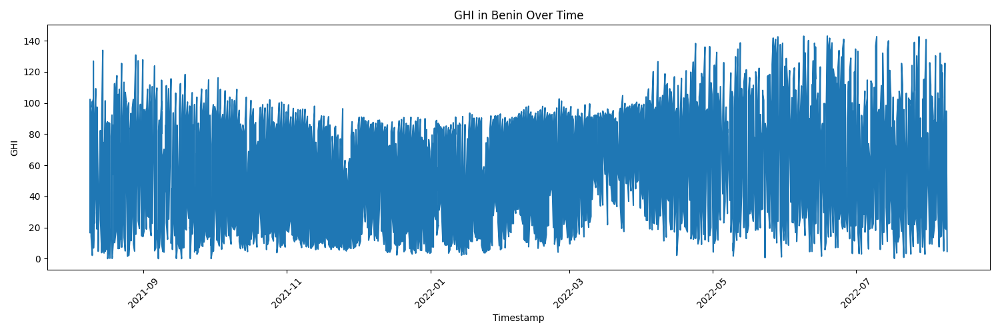
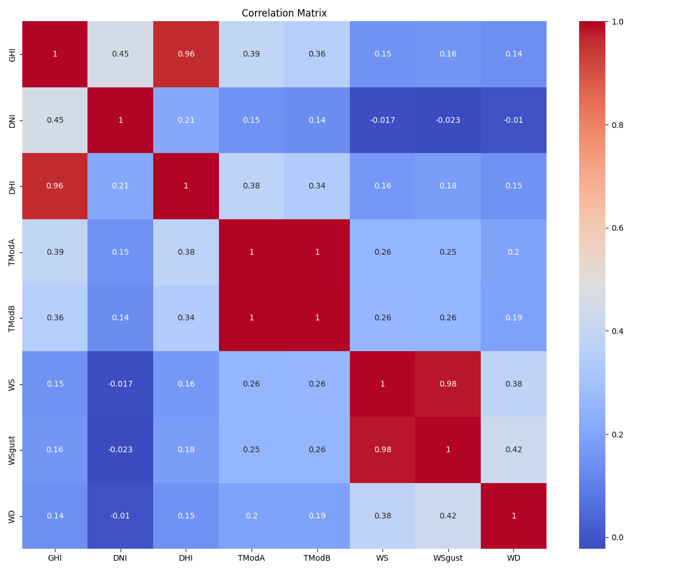
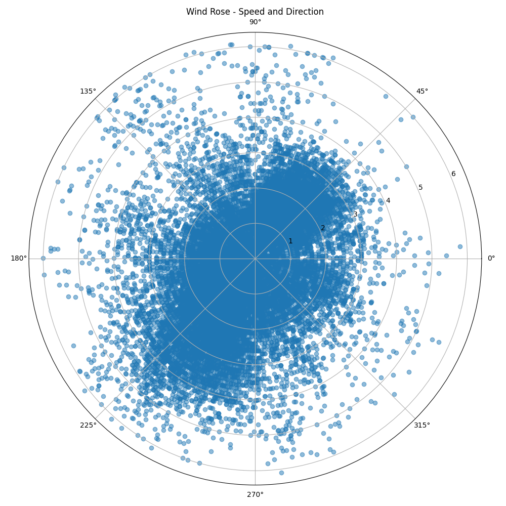
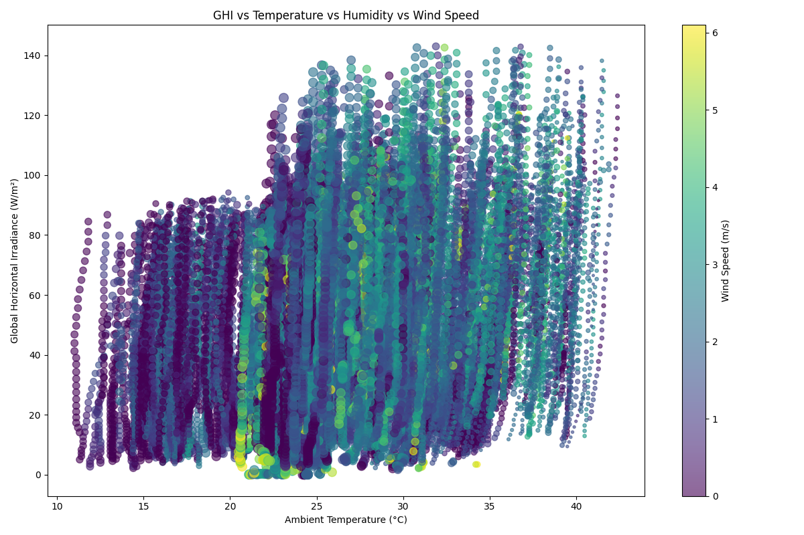

# Solar Radiation Analysis in West Africa

## Project Overview

This project analyzes solar radiation data from three West African countries (Benin, Sierra Leone, and Togo) to support MoonLight Energy Solutions in developing a strategic approach for solar energy investments. Our goal is to enhance operational efficiency and sustainability through data-driven insights.

## Data Sources

We analyzed environmental measurements from three countries:
- Benin
- Sierra Leone
- Togo

## Methodology

Our analysis followed these key steps:

1. **Data Loading and Cleaning**: Processed data from CSV files for each country, handling missing values and outliers.
2. **Exploratory Data Analysis (EDA)**: Conducted thorough analysis to understand data distribution and patterns.
3. **Statistical Analysis**: Performed various statistical tests to derive meaningful insights.
4. **Visualization**: Created multiple visualizations to represent findings effectively.
5. **Dashboard Creation**: Developed an interactive Streamlit dashboard for user-friendly data exploration.

## Key Findings

### 1. Solar Radiation Patterns

- **Benin**: Highest average GHI (52.72 W/m²) and maximum GHI (143.00 W/m²)
- **Sierra Leone**: Second highest average GHI (46.00 W/m²) and maximum GHI (127.90 W/m²)
- **Togo**: Surprisingly low average GHI (0.84 W/m²) and maximum GHI (36.20 W/m²)

### 2. Temperature and Humidity

- Average temperatures were similar across countries (25.54°C - 27.42°C)
- Sierra Leone showed significantly higher humidity (83.50%) compared to Benin (61.14%) and Togo (59.82%)

### 3. Wind Patterns

- Togo: Highest average wind speed (1.78 m/s)
- Benin: Second highest average wind speed (1.59 m/s)
- Sierra Leone: Lowest average wind speed (0.81 m/s)

### 4. GHI and Temperature Correlation

- Weak correlation in all countries
- Benin: 0.25
- Sierra Leone: 0.12
- Togo: 0.03

### 5. Data Distribution

- No occurrences of GHI above 500 W/m² in any country
- Varying number of data points: Togo (277,213), Sierra Leone (29,172), Benin (27,195)

## Visualizations

Our analysis generated several key visualizations to help understand the data:

1. **Time Series Analysis**: 
   
   This plot shows the Global Horizontal Irradiance (GHI) over time, highlighting daily and seasonal patterns for each country.

2. **Correlation Heatmap**:
   
   This heatmap visualizes the correlations between key variables, helping identify strong relationships between different environmental factors.

3. **Wind Rose**:
   
   The wind rose plot shows the distribution of wind speed and direction, crucial for understanding wind patterns in each country.

4. **Bubble Chart**:
   
   This chart explores the complex relationship between GHI, temperature, humidity, and wind speed, providing a multi-dimensional view of the data.

These visualizations are crucial for understanding the solar radiation patterns, wind characteristics, and relationships between different environmental variables in Benin, Sierra Leone, and Togo.

## Recommendations

1. **Prioritize Benin**: Focus solar installations in Benin due to highest average and maximum GHI.
2. **Investigate Togo's Data**: Further examine the unusually low GHI readings in Togo.
3. **Humidity Considerations**: Account for high humidity in Sierra Leone when planning installations.
4. **Explore Wind Energy**: Consider wind energy projects in Togo and Benin.
5. **Optimize for Moderate Radiation**: Design systems for performance under moderate GHI levels.
6. **Conduct Seasonal Analysis**: Perform detailed temporal analysis to reveal seasonal patterns.
7. **Improve Data Collection**: Standardize methods across all sites for consistency.

## Future Work

1. Investigate reasons for Togo's low GHI readings.
2. Conduct granular analysis of seasonal and daily solar radiation patterns.
3. Study humidity impact on solar panel efficiency, especially in Sierra Leone.
4. Assess potential for hybrid solar-wind projects in Togo and Benin.
5. Incorporate detailed geographical data for optimal installation locations.

## Conclusion

This analysis provides MoonLight Energy Solutions with data-driven insights for their solar investment strategy in West Africa. The unexpected variations in solar radiation levels between neighboring countries highlight the importance of localized, data-driven approaches to renewable energy development.

## Interactive Dashboard

Explore our findings through our interactive Streamlit dashboard:

[Solar Radiation Analysis Dashboard](https://solar-10academy.streamlit.app/)

## Getting Started

To run this project locally:

1. Clone the repository
2. Install required packages: `pip install -r requirements.txt`
3. Run the Streamlit app: `streamlit run app.py`

## Contributors

- [Kidus Yohannes]
